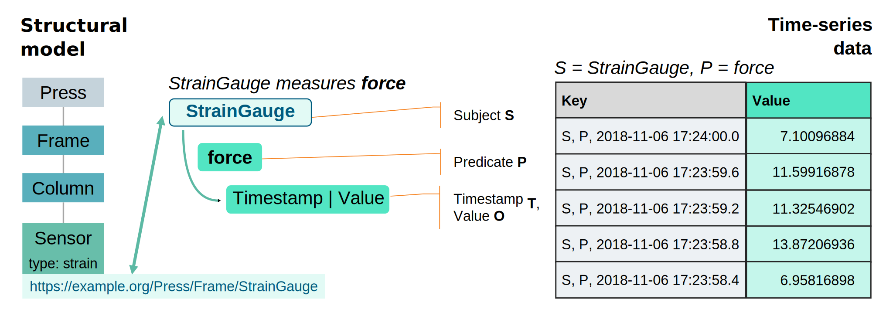

[](https://hub.docker.com/r/linkedfactory/linkedfactory-pod)

# Welcome to the LinkedFactory Pod repository

This is the reference implementation of the 
**[LinkedFactory architecture](https://github.com/linkedfactory/specification)**.

LinkedFactory (LF) is a data architecture concept for structuring time-series data by using semantic descriptions of assets to create connected digital representations of technical systems.

The core idea is to use an RDF knowledge graph for describing the structure of systems with their components and relationships. The components are identified by URIs and may have associated time-series data. To organize these measurements, the component's URI **S** is used as a key in combination with a predicate URI **P** and a timestamp **T** to uniquely qualify values. The resulting composite key is then used to store the associated data in a key-value store or it is mapped to the structure of a tailored time-series database.



## Data representation
Formally, the triple-based data model of RDF _(S, P, O)_ is extended to a quad-based data model _(S, P, T, O)_. If named graphs are used to manage multiple RDF datasets then an additional context **C** can be introduced to extend the data model to _(C, S, P, T, O)_. We call this the **Kvin** data model.

### JSON format
The primary data format is the __LF JSON format__ that uses a nested structure where the first level contains the items and the second level the associated properties with their values:

```json
{
    "http://example.org/resource1": {
       "http://example.org/properties/p1": [
           { "value": 20.4, "time": 1619424246120 },
           { "value": 20.3, "time": 1619424246100 }
       ],
       "http://example.org/properties/p2": [
           { "value": { "msg" : "Error 1", "nr" : 1 }, "time": 1619424246100 }
       ]
    }
}
```

A concrete example for modeling the captured force data of a strain gauge could be represented as:
```json
{
  "https://example.org/Press/Frame/StrainGauge": {
    "p:force" : [{ "value": 7.10096884, "time": 1541521440000 }]
  }
}
```
### RDF format
For representing time-series data in plain RDF the following encoding is used:
```
S P [ <kvin:value> O ; <kvin:time> T ] .
```

The data of the strain gauge example above could then expressed as:
```
@base <https://example.org/Press/Frame/> .

<StrainGauge> <p:force> [ <kvin:value> 7.10096884 ; <kvin:time> 1541521440000 ] .
```

## Data insertion and retrieval
### HTTP APIs
The data can be inserted and queried by using __[HTTP-based APIs](https://linkedfactory.github.io/specification/overview/1/timeseries/api)__.

For inserting the data the LF JSON format can be used as follows:
```sh
curl -H "Content-Type:application/json" http://localhost:8080/linkedfactory/values -d '{
  "https://example.org/Press/Frame/StrainGauge": {
    "p:force" : [{ "value": 7.10096884, "time": 1541521440000 }]
  }
}'
```
If data with the same timestamps should be inserted then the CSV format is more concise:
```sh
curl -H "Content-Type:text/csv" http://localhost:8080/linkedfactory/values -d 'time,<https://example.org/Press/Frame/StrainGauge>@<p:force>
1541521440000, 7.10096884'
```

Retrieving the data in JSON format is possible through a simple GET request:
```sh
curl -G -d "item=https://example.org/Press/Frame/StrainGauge" -d "property=p:force" http://localhost:8080/linkedfactory/values
```

Just specify an accept header to retrieve data in CSV format:
```sh
curl -G -H "Accept:text/csv" -d "item=https://example.org/Press/Frame/StrainGauge" -d "property=p:force" http://localhost:8080/linkedfactory/values
```

### SPARQL
Additionaly, due to the compatiblity with RDF, it is possible to query the data with SPARQL.

```
curl -H "Accept:text/csv" http://localhost:8080/sparql --data-urlencode 'query=
base <https://example.org/Press/Frame/>

select ?time ?value {
  service <kvin:> {
    <StrainGauge> <p:force> [ <kvin:value> ?value ; <kvin:time> ?time ] .
  }
}' --data-urlencode 'model=http://linkedfactory.github.io/data/'
```

## Docker
* We provide containers on [Docker Hub](https://hub.docker.com/r/linkedfactory/linkedfactory-pod)
* `docker run -p 8080:8080 -v /tmp/workspace:/linkedfactory-pod/workspace linkedfactory/linkedfactory-pod`

## Building
* This is a plain Maven project
* a full build can be executed via `mvn package`

## Running 
* change to the folder `launch/equinox`
* run `mvn test -Pconfigure -DskipTests` to initialize or update a launch configuration
* run `mvn test` to (re-)start the POD instance
* The application should now be available at: [http://localhost:8080/linkedfactory/](http://localhost:8080/linkedfactory/)

## Developing
* The project can be developed with any IDE supporting Java and Scala projects
* **IDEA:** `File > Project from existing sources...`
* **Eclipse:** `File > Import > Maven > Existing Maven Projects`
