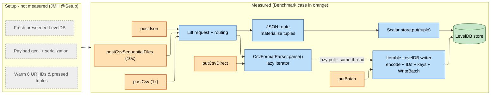

# KVIN Ingestion Benchmarks

This benchmark compares one deterministic 30,000-tuple ingestion batch through
the direct KVIN LevelDB API and the in-process JSON and CSV service endpoints.
It is an opt-in test benchmark and does not start the POD or open network
sockets.

## Quick Start

All commands run from the repository root. Results are written as JSON under the
relevant module `target/` directory.

**1. Build once:**

```sh
mvn -U clean install -DskipTests
```

This clean reactor build compiles the benchmark sources and generates JMH's
benchmark registry.

**2. Run the benchmarks with the comparison protocol** (3 warmups, 5 measurements, 2 forks, 1 thread):

```sh

### Primary ingestion benchmarks (putBatch, postJson, postCsv, putCsvDirect, postCsvSequentialFiles)

mvn -pl bundles/io.github.linkedfactory.service -Pjmh \
  -Djmh.warmups=3 -Djmh.measurements=5 -Djmh.forks=2 \
  -Djmh.result.file=target/jmh-primary.json test-compile exec:exec

### CSV attribution diagnostics

mvn -pl bundles/io.github.linkedfactory.service -Pjmh \
  -Djmh.includes=io.github.linkedfactory.service.benchmark.KvinIngestionCsvDiagnosticBenchmark \
  -Djmh.warmups=3 -Djmh.measurements=5 -Djmh.forks=2 \
  -Djmh.result.file=target/jmh-csv-diagnostic.json test-compile exec:exec

### JSON diagnostics

mvn -pl bundles/io.github.linkedfactory.service -Pjmh \
  -Djmh.includes=io.github.linkedfactory.service.benchmark.KvinIngestionJsonDiagnosticBenchmark \
  -Djmh.warmups=3 -Djmh.measurements=5 -Djmh.forks=2 \
  -Djmh.result.file=target/jmh-json-diagnostic.json test-compile exec:exec
```

**3. Read the results** (method, ms/op, JMH error, derived tuples/s):

```sh
jq -r '.[] | [(.benchmark | split(".")[-1]), .primaryMetric.score, .primaryMetric.scoreError, (30000000 / .primaryMetric.score)] | @tsv' \
  bundles/io.github.linkedfactory.service/target/jmh-primary.json
```

Gives output like
```sh
(method)        (ms/op)                 (JMH error)             (tuples/s)   
postCsv         72.29846979999999       24.080653592587588      414946.5415103433
postCsvSequentialFiles  80.8543817      17.14687428124646       371037.40538529155
postJson        235.88979579999994      37.99118818211922       127178.03200540143
putBatch        43.564955499999996      27.169511316820625      688626.8941557854
putCsvDirect    62.84361260000001       53.04789937599848       477375.4842986222
````

**4. Before drawing any conclusion,** repeat the same command as an independent
Run B with a different `-Djmh.result.file` and compare.

#### Smoke test only 

> not a valid measurement, just checks that everything starts:

`-Djmh.warmups=0 -Djmh.measurements=1 -Djmh.forks=1`


### Optional flags

- `-Djmh.includes=<regex>`: run only the benchmarks matching the pattern.
- `-Djmh.temp.root=/tmp`: override the temporary LevelDB root without changing
  production storage behavior.
- `-Djmh.warmups`, `-Djmh.measurements`, `-Djmh.forks`, `-Djmh.result.file`:
  standard JMH run controls used above.

The JMH profile never runs during a normal build or `mvn test`. Benchmarks only
start when you explicitly pass `-Pjmh` and call the `exec:exec` goal. This keeps
them out of standard build and CI pipelines.

## Prerequisites

- JDK 21. The project release is Java 21.
- Maven 3.9.x or another version new enough for `scala-maven-plugin:4.9.10`.
  Maven 3.9.9 is known to work in this repository.
- A quiet host with a stable power mode. Use the same commit, workload source,
  JDK, filesystem, and JMH settings when comparing runs.

The benchmark creates a fresh temporary LevelDB store for every invocation,
warms six URI IDs with six preseed tuples, validates the persisted set, closes
the store, and removes the temporary directory.

---

## Reference

### Workload

Each operation is one request or one direct batch containing exactly 30,000
`KvinTuple` values: 5,000 rows across six stable item URIs, one property, one
context, 1,000 timestamps, and sequence numbers 1 through 5. JSON, CSV, and
direct input normalize to the same tuple set. Payload generation and
serialization happen during JMH trial setup, outside measured methods. The
prebuilt tuple list uses the same row-major order emitted by the CSV parser, so
the direct/CSV comparison does not also compare insertion orders.

#### KVIN Tuples

A tuple is one KVIN value with its identity and ordering metadata:

```text
(item URI, property URI, context URI, timestamp, sequence number, value)
```

For example, the first canonical value is:

```text
item:     http://iwu.lf.de/ecc4p/emag/channel-1
property: http://iwu.lf.de/ecc4p/values
context:  http://iwu.lf.de/ecc4p/models/emag
time:     1710000000000
seqNr:    1
value:    0.25
```

One CSV data row contains one `time`, one `seqNr`, and six channel values, so
it expands to six tuples. The 5,000-row workload therefore contains exactly
30,000 tuples.

### Benchmarks

The measured benchmarks are:

- `putBatch`: calls `KvinLevelDb.put(Iterable<KvinTuple>)` with prebuilt tuples.
  It measures KVIN encoding, warm ID resolution, batching, and LevelDB writes.
- `postCsv`: sends cached CSV bytes through an in-process Lift request and the
  production CSV route. It includes request creation/routing, OpenCSV decoding,
  value interpretation, tuple construction, and iterable LevelDB persistence.
- `postJson`: sends cached JSON bytes through the in-process Lift request and
  production JSON route. The current route materializes JSON tuples and writes
  them through scalar `store.put(tuple)` calls.
- `putCsvDirect`: connects the production CSV parser directly to the iterable
  LevelDB writer, excluding Lift request creation and routing.
- `postCsvSequentialFiles`: sends ten separate 3,000-tuple CSV requests to one
  service and store during the same measured invocation.

Endpoint methods include Lift request creation, routing, request decoding, and
persistence. They exclude sockets, TLS, authentication, server startup,
fixture generation, serialization, and post-run correctness scans.

CSV parsing and persistence are interleaved sequentially on the one JMH thread:
LevelDB pulls the next tuple from the lazy parser, processes it, then pulls the
next. Parser and writer are not parallel.

#### Benchmark entry points visualized



#### Measured steps in benchmarks

| Benchmark | Lift routing | Parse | Writer | LevelDB |
|---|---|---|---|---|
| `putBatch` | – | – | ✓ Iterable writer | ✓ |
| `putCsvDirect` | – | ✓ (csv) | ✓ Iterable writer | ✓ |
| `postCsv` | ✓ | ✓ (csv) | ✓ Iterable writer | ✓ |
| `postCsvSequentialFiles` | ✓ ×10 | ✓ (10x csv) | ✓ Iterable writer (shared) | ✓ (shared) |
| `postJson` | ✓ | ✓ (json) | ✓ Scalar put | ✓ |

### Running a subset

The class-wide default runs `putBatch`, `postJson`, `postCsv`, `putCsvDirect`,
and `postCsvSequentialFiles`. To run only the four current direct/CSV controls:

```sh
mvn -pl bundles/io.github.linkedfactory.service -Pjmh \
  -Djmh.includes='io.github.linkedfactory.service.benchmark.KvinIngestionBenchmark\.(putBatch|putCsvDirect|postCsv|postCsvSequentialFiles)' \
  -Djmh.warmups=3 -Djmh.measurements=5 -Djmh.forks=2 \
  -Djmh.result.file=target/jmh-csv-controls.json test-compile exec:exec
```

### In-depth attribution

#### CSV attribution diagnostics

This suite attributes CSV ingestion cost to its individual stages: decoding,
parsing, and routing. Each benchmark adds one more layer on top of the previous
one, so read them as nested boundaries, not additive stages. You cannot subtract
one score from another to get an exact per-stage time (see "Reading Results"),
but you can use them to decide where to profile or optimize.

| Benchmark | Adds on top of the previous stage | Measures |
|---|---|---|
| `consumePrebuilt` | Nothing; consumes prebuilt tuples via `Blackhole` | The consumption floor / baseline iteration cost |
| `decodeCsvAndConsumeFields` | OpenCSV reader, tokenization, field string creation (production parser config) | Raw CSV decoding cost |
| `parseCsvAndConsumeTuples` | Header mapping, trimming, type interpretation, `KvinTuple` creation (no LevelDB) | Turning fields into real tuples |
| `postCsvParseOnly` | Real in-process Lift route + iterable sink that discards tuples | Routing cost, without persistence |

#### JSON diagnostics

The JSON diagnostic class isolates the JSON path in the same way:

| Benchmark | Measures |
|---|---|
| `postJsonParseOnly` | The production JSON request path against a non-persistent result |
| `putScalar` | Prebuilt tuples written through the scalar KVIN API, matching the persistence style the JSON route currently uses |

### Reading Results

JMH reports a mean and an error interval for each single-shot batch. Use the
raw JSON for the values, not a hand-timed loop. The derived rates are:

```text
tuples/s = 30,000,000 / batch_ms
payload MiB/s = payload_bytes / 1,048,576 / (batch_ms / 1,000)
```

The `jq` command in the Quick Start prints method, mean milliseconds per
operation, JMH error, and derived tuples per second. Include the raw JMH
environment header and error intervals when publishing results.

Interpret the controls as boundaries, not additive stages:

- `putBatch` is the shared prebuilt persistence baseline.
- `putCsvDirect` adds lazy CSV decoding, conversion, and tuple allocation, but
  excludes Lift routing.
- `postCsv` is the authoritative in-process CSV endpoint result.
- `postCsvSequentialFiles - postCsv` is a directional request-splitting signal
  for ten files, not multipart or network overhead.
- `parseCsvAndConsumeTuples` isolates production tuple parsing without LevelDB;
  `decodeCsvAndConsumeFields` is a tokenizer/field-allocation control.

Independent benchmark scores cannot be subtracted into exact code-stage times,
because sources and sinks interact and the uncertainty intervals may overlap.
Use diagnostics to choose a profiler or optimization candidate, then require the
complete `postCsv` result to improve in two independent runs.

### Local Evolution Log

Machine-specific history is deliberately not tracked. When doing performance
work, create this append-only file:

```sh
mkdir -p .cache-main/benchmarks
touch .cache-main/benchmarks/kvin-ingestion-evolution.md
```