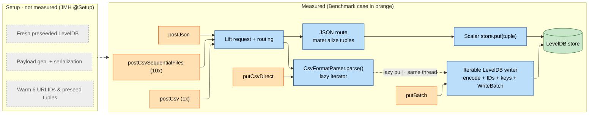

# KVIN Ingestion Benchmarks

This benchmark compares deterministic 30,000-tuple ingestion batches through
the direct KVIN LevelDB API and the in-process JSON and CSV service endpoints.
It is an opt-in test benchmark and does not start the POD or open network
sockets. Primary results are reported directly as tuples per second.

## Quick Start

All commands run from the repository root. Results are written as JSON under the
relevant module `target/` directory.

**1. Build once:**

```sh
mvn -U clean install -DskipTests
```

This clean reactor build compiles the benchmark sources and generates JMH's
benchmark registry.

**2. Run the primary benchmarks with the comparison protocol** (3 three-second
warmups, 5 three-second measurements, 2 forks, 1 thread):

```sh
mvn -pl bundles/io.github.linkedfactory.service -Pjmh \
  -Djmh.result.file=target/jmh-primary-run-a.json test-compile exec:exec
```

The defaults exercise five methods for 240 timed seconds
(`5 methods × 8 iterations × 2 forks × 3 seconds`); including trial setup,
invocation setup, validation, and store cleanup, allow approximately five
minutes. Repeat the command with `jmh-primary-run-b.json` before comparing
implementations.

**3. Run attribution diagnostics when needed:**

```sh
# CSV attribution diagnostics

mvn -pl bundles/io.github.linkedfactory.service -Pjmh \
  -Djmh.includes=io.github.linkedfactory.service.benchmark.KvinIngestionCsvDiagnosticBenchmark \
  -Djmh.warmups=3 -Djmh.measurements=5 -Djmh.forks=2 \
  -Djmh.result.file=target/jmh-csv-diagnostic.json test-compile exec:exec

# JSON diagnostics

mvn -pl bundles/io.github.linkedfactory.service -Pjmh \
  -Djmh.includes=io.github.linkedfactory.service.benchmark.KvinIngestionJsonDiagnosticBenchmark \
  -Djmh.warmups=3 -Djmh.measurements=5 -Djmh.forks=2 \
  -Djmh.result.file=target/jmh-json-diagnostic.json test-compile exec:exec
```

**4. Read the primary results** (method, tuples/s, JMH error):

```sh
jq -r '.[] | [(.benchmark | split(".")[-1]), .primaryMetric.score, .primaryMetric.scoreError, .primaryMetric.scoreUnit] | @tsv' \
  bundles/io.github.linkedfactory.service/target/jmh-primary-run-a.json
```

Diagnostic suites deliberately remain single-shot batch timings in `ms/op` and
do not use `OperationsPerInvocation`.

#### Smoke test only

> not a valid measurement, just checks that everything starts:

`-Djmh.warmups=0 -Djmh.measurements=1 -Djmh.measurement.time=1s -Djmh.forks=1`


### Optional flags

- `-Djmh.includes=<regex>`: run only the benchmarks matching the pattern.
- `-Djmh.temp.root=/tmp`: override the temporary LevelDB root without changing
  production storage behavior.
- `-Djmh.warmups`, `-Djmh.warmup.time`, `-Djmh.measurements`,
  `-Djmh.measurement.time`, `-Djmh.forks`, `-Djmh.result.file`: JMH run controls.

The JMH profile never runs during a normal build or `mvn test`. Benchmarks only
start when you explicitly pass `-Pjmh` and call the `exec:exec` goal. This keeps
them out of standard build and CI pipelines.

## Prerequisites

- JDK 21. The project release is Java 21.
- Maven 3.9.x or another version new enough for `scala-maven-plugin:4.9.10`.
  Maven 3.9.9 is known to work in this repository.
- A quiet host with a stable power mode. Use the same commit, workload source,
  JDK, filesystem, and JMH settings when comparing runs.

The benchmark creates a fresh temporary LevelDB store for every invocation,
warms the selected six item/property IDs with six preseed tuples, validates the
persisted set, closes the store, and removes the temporary directory.

---

## Reference

### Workload

Each invocation processes one of ten immutable variants. Every variant contains
exactly 30,000 `KvinTuple` values: 5,000 rows across six item URIs, one property,
one context, 1,000 timestamps, and sequence numbers 1 through 5. The channel
pool contains 100 zero-padded URIs and is shuffled once with seed
`0x4B56494E_20260721L`. Variants use non-overlapping six-channel slices from
that order and ten distinct properties from a pool of ten.

Timestamps advance in one-second steps. Variant `n` starts at
`1710000000000 + n × 1000000`, giving each variant a disjoint deterministic
timestamp window. The numeric value formula remains relative to the six CSV
columns, keeping value parsing and payload sizes comparable across variants.

All ten tuple lists, JSON payloads, CSV payloads, and ten-file CSV partitions
are generated and cached during JMH trial setup, outside measured methods.
Invocation setup rotates through variants zero through nine, then repeats. Each
trial and fork begins at variant zero. JSON, CSV, partitioned CSV, and direct
input normalize to the same tuple set for their selected variant. The prebuilt
tuple list uses the same row-major order emitted by the CSV parser, so the
direct/CSV comparison does not also compare insertion orders.

#### KVIN Tuples

A tuple is one KVIN value with its identity and ordering metadata:

```text
(item URI, property URI, context URI, timestamp, sequence number, value)
```

For example, the first canonical value is:

```text
item:     one deterministic selection from .../emag/channel-000 through channel-099
property: one of .../property-00 through property-09
context:  http://iwu.lf.de/ecc4p/models/emag
time:     1710000000000
seqNr:    1
value:    0.25
```

One CSV data row contains one `time`, one `seqNr`, and six channel values, so
it expands to six tuples. The 5,000-row workload therefore contains exactly
30,000 tuples.

### Benchmarks

The measured benchmarks are:

- `putBatch`: calls `KvinLevelDb.put(Iterable<KvinTuple>)` with prebuilt tuples.
  It measures KVIN encoding, warm ID resolution, batching, and LevelDB writes.
- `postCsv`: sends cached CSV bytes through an in-process Lift request and the
  production CSV route. It includes request creation/routing, OpenCSV decoding,
  value interpretation, tuple construction, and iterable LevelDB persistence.
- `postJson`: sends cached JSON bytes through the in-process Lift request and
  production JSON route. The current route materializes JSON tuples and writes
  them through scalar `store.put(tuple)` calls.
- `putCsvDirect`: connects the production CSV parser directly to the iterable
  LevelDB writer, excluding Lift request creation and routing.
- `postCsvSequentialFiles`: sends ten separate 3,000-tuple CSV requests to one
  service and store during the same measured invocation.

Endpoint methods include Lift request creation, routing, request decoding, and
persistence. They exclude sockets, TLS, authentication, server startup,
fixture generation, serialization, and post-run correctness scans.

CSV parsing and persistence are interleaved sequentially on the one JMH thread:
LevelDB pulls the next tuple from the lazy parser, processes it, then pulls the
next. Parser and writer are not parallel.

#### Benchmark entry points visualized



#### Measured steps in benchmarks

| Benchmark | Lift routing | Parse | Writer | LevelDB |
|---|---|---|---|---|
| `putBatch` | – | – | ✓ Iterable writer | ✓ |
| `putCsvDirect` | – | ✓ (csv) | ✓ Iterable writer | ✓ |
| `postCsv` | ✓ | ✓ (csv) | ✓ Iterable writer | ✓ |
| `postCsvSequentialFiles` | ✓ ×10 | ✓ (10x csv) | ✓ Iterable writer (shared) | ✓ (shared) |
| `postJson` | ✓ | ✓ (json) | ✓ Scalar put | ✓ |

### Running a subset

The class-wide default runs `putBatch`, `postJson`, `postCsv`, `putCsvDirect`,
and `postCsvSequentialFiles`. To run only the four current direct/CSV controls:

```sh
mvn -pl bundles/io.github.linkedfactory.service -Pjmh \
  -Djmh.includes='io.github.linkedfactory.service.benchmark.KvinIngestionBenchmark\.(putBatch|putCsvDirect|postCsv|postCsvSequentialFiles)' \
  -Djmh.warmups=3 -Djmh.measurements=5 -Djmh.forks=2 \
  -Djmh.result.file=target/jmh-csv-controls.json test-compile exec:exec
```

### In-depth attribution

#### CSV attribution diagnostics

This suite attributes CSV ingestion cost to its individual stages: decoding,
parsing, and routing. Each benchmark adds one more layer on top of the previous
one, so read them as nested boundaries, not additive stages. You cannot subtract
one score from another to get an exact per-stage time (see "Reading Results"),
but you can use them to decide where to profile or optimize.

| Benchmark | Adds on top of the previous stage | Measures |
|---|---|---|
| `consumePrebuilt` | Nothing; consumes prebuilt tuples via `Blackhole` | The consumption floor / baseline iteration cost |
| `decodeCsvAndConsumeFields` | OpenCSV reader, tokenization, field string creation (production parser config) | Raw CSV decoding cost |
| `parseCsvAndConsumeTuples` | Header mapping, trimming, type interpretation, `KvinTuple` creation (no LevelDB) | Turning fields into real tuples |
| `postCsvParseOnly` | Real in-process Lift route + iterable sink that discards tuples | Routing cost, without persistence |

#### JSON diagnostics

The JSON diagnostic class isolates the JSON path in the same way:

| Benchmark | Measures |
|---|---|
| `postJsonParseOnly` | The production JSON request path against a non-persistent result |
| `putScalar` | Prebuilt tuples written through the scalar KVIN API, matching the persistence style the JSON route currently uses |

### Reading Results

For the five primary methods, `OperationsPerInvocation(30000)` makes JMH report
the mean and error directly in `ops/s`, where one operation is one tuple. Read
these tuple/s values from the raw JSON rather than deriving them from rounded
batch times. An equivalent 30,000-tuple batch time can be calculated for a
presentation table as `30,000 / tuples_per_second × 1,000` milliseconds.

Diagnostics report single-shot batch time in `ms/op`; their unit and semantic
boundary are intentionally different. Include the JMH environment header,
score unit, and error intervals when publishing results.

Use the three-second defaults for comparisons and require two independent full
runs. A short smoke run or a duration-sensitivity check is validation, not a
publishable performance result.

#### Run A reference result

Run A used the protocol above on 2026-07-21. The commit column names the base
commit; the benchmark included the workload-variant changes in this patch.

| Benchmark | Tuples/s | JMH error | Equivalent 30,000-tuple batch |
|---|---:|---:|---:|
| `postCsv` | 737,270 | ±23,597 | 40.69 ms |
| `postCsvSequentialFiles` | 669,339 | ±65,246 | 44.82 ms |
| `postJson` | 499,159 | ±109,763 | 60.10 ms |
| `putBatch` | 1,468,205 | ±133,007 | 20.43 ms |
| `putCsvDirect` | 840,222 | ±196,984 | 35.70 ms |

| Environment | Value |
|---|---|
| Base commit | `733a33d` |
| Date | 2026-07-21 |
| CPU | Intel Core i7-1185G7 @ 3.00 GHz, 4 vCPUs |
| OS | Linux 5.15.123.1-microsoft-standard-WSL2, x86_64 |
| JDK | Eclipse Temurin 21.0.11+10 LTS |

The independent Run B scores were 761,544, 640,135, 468,624, 1,672,301,
and 920,589 tuples/s in the table's method order. Every Run A and Run B JMH
confidence interval overlapped; Run B serves as the consistency check rather
than a second result to average into Run A.

Interpret the controls as boundaries, not additive stages:

- `putBatch` is the shared prebuilt persistence baseline.
- `putCsvDirect` adds lazy CSV decoding, conversion, and tuple allocation, but
  excludes Lift routing.
- `postCsv` is the authoritative in-process CSV endpoint result.
- `postCsvSequentialFiles - postCsv` is a directional request-splitting signal
  for ten files, not multipart or network overhead.
- `parseCsvAndConsumeTuples` isolates production tuple parsing without LevelDB;
  `decodeCsvAndConsumeFields` is a tokenizer/field-allocation control.

Independent benchmark scores cannot be subtracted into exact code-stage times,
because sources and sinks interact and the uncertainty intervals may overlap.
Use diagnostics to choose a profiler or optimization candidate, then require the
complete `postCsv` result to improve in two independent runs.

### Local Evolution Log

Beyond the reference run above, machine-specific history is deliberately not
tracked. When doing performance work, create this append-only file:

```sh
mkdir -p .cache-main/benchmarks
touch .cache-main/benchmarks/kvin-ingestion-evolution.md
```
