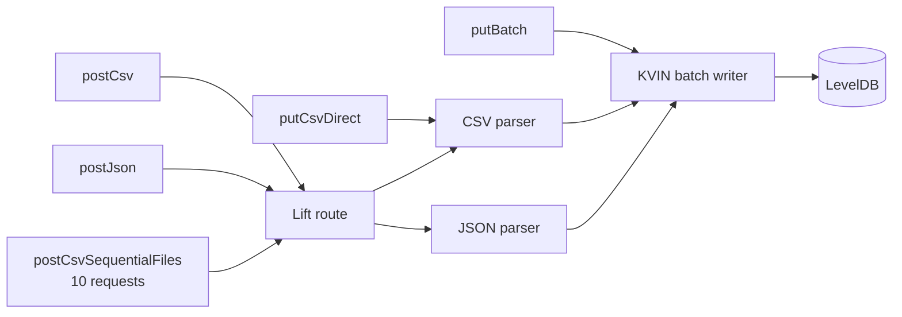

# KVIN Ingestion Benchmarks

This JMH suite measures **KVIN ingestion throughput** through the direct LevelDB API and the in-process JSON and CSV service routes.

Each primary benchmark processes **30,000 `KvinTuple`s per invocation**. JMH reports throughput as `ops/s`; `@OperationsPerInvocation(30000)` normalizes the result so that:

> **1 op = 1 KvinTuple**

The displayed `ops/s` score therefore directly represents tuple throughput.

Test-data generation, validation, cleanup, network transport, TLS, and server startup are outside the timed methods.

## What is measured



| Benchmark                | Measures                                                                |
| ------------------------ | ----------------------------------------------------------------------- |
| `putBatch`               | Prebuilt tuples → KVIN encoding / ID resolution / batch write → LevelDB |
| `putCsvDirect`           | CSV parsing + tuple creation + persistence, without Lift routing        |
| `postCsv`                | In-process CSV request → route → parsing → persistence                  |
| `postJson`               | In-process JSON request → route → parsing → persistence                 |
| `postCsvSequentialFiles` | Ten sequential CSV requests to the same service and store               |

`putBatch` is the persistence baseline. `putCsvDirect` adds CSV parsing. `postCsv` and `postJson` represent the main in-process service ingestion paths.

### Test data

Before measurement starts, the benchmark creates **10 fixed workload variants**. Each variant contains **5,000 rows across 6 channels, producing 30,000 `KvinTuple`s**.

A channel represents one KVIN **item URI**, i.e. one time-series source. In CSV input, the six channels correspond to six value columns. Each resulting tuple contains:

```text
(item, property, context, timestamp, sequence number, value)
```

For each workload variant:

* **6 channels** are selected from a pool of 100 item URIs. The pool is shuffled once with a fixed seed, so the same variant always receives the same channels across benchmark runs.
* **1 property** is selected from a pool of 10 properties, with a different property assigned to each variant.
* **1 context** is shared by all tuples.
* **1,000 timestamps** form a fixed time window for that variant.
* **5 sequence numbers per timestamp** produce the 5,000 rows.
* Each row contains values for all 6 channels, resulting in `5,000 × 6 = 30,000` tuples.

During measurement, the benchmark cycles through the 10 workload variants on repeat. Each warmup or measurement iteration runs the benchmark repeatedly for 3 seconds, so the ten variants are normally cycled through many times. The exact number of repetitions depends on how many benchmark invocations complete during that time.

The variant sequence and contents remain fixed across runs; each persistence invocation writes its selected variant to a fresh temporary LevelDB store.

## Run

From the repository root, build once:

```sh
mvn clean install -DskipTests
```

Run the five primary benchmarks:

```sh
mvn -pl bundles/io.github.linkedfactory.service -Pjmh \
  -Djmh.result.file=target/jmh-primary.json \
  test-compile exec:exec
```

The default run uses 3 × 3 s warmups, 5 × 3 s measurements, 2 forks, and 1 thread.

When comparing a change, repeat the full run with a separate result file.

## Results

A full run produces standard JMH throughput output like:

```text
Benchmark                                       Mode  Cnt        Score        Error  Units
KvinIngestionBenchmark.postCsv                 thrpt   10   712702.231 ± 234440.177  ops/s
KvinIngestionBenchmark.postCsvSequentialFiles  thrpt   10   692147.445 ± 279633.790  ops/s
KvinIngestionBenchmark.postJson                thrpt   10   504792.294 ±  42078.535  ops/s
KvinIngestionBenchmark.putBatch                thrpt   10  1673947.197 ± 132642.643  ops/s
KvinIngestionBenchmark.putCsvDirect            thrpt   10   880491.470 ± 126678.908  ops/s
```

For the primary benchmarks, these values are already normalized to `KvinTuple`s per second. For example, `880491 ops/s` means approximately **880,491 tuples/s**.

Results are also written as JSON. Print a compact summary with:

```sh
jq -r '.[] |
  [(.benchmark | split(".")[-1]),
   .primaryMetric.score,
   .primaryMetric.scoreError,
   .primaryMetric.scoreUnit] |
  @tsv' \
  bundles/io.github.linkedfactory.service/target/jmh-primary.json
```

Use the score together with its error interval when comparing runs. The values above are example measurements, not performance thresholds.

## Diagnostics

Diagnostics go **one level deeper** when a primary benchmark shows that CSV or JSON ingestion needs investigation. Unlike the primary suite, they time complete diagnostic invocations in `ms/op`.

### CSV diagnostics

Use these when the difference between `putBatch`, `putCsvDirect`, and `postCsv` suggests that CSV parsing or routing is responsible for significant overhead.

```sh
mvn -pl bundles/io.github.linkedfactory.service -Pjmh \
  -Djmh.includes=io.github.linkedfactory.service.benchmark.KvinIngestionCsvDiagnosticBenchmark \
  -Djmh.result.file=target/jmh-csv-diagnostic.json \
  test-compile exec:exec
```

With example result:

```text
Benchmark                                                      Mode  Cnt   Score    Error  Units
KvinIngestionCsvDiagnosticBenchmark.consumePrebuilt              ss   10   0.384 ±  0.290  ms/op
KvinIngestionCsvDiagnosticBenchmark.decodeCsvAndConsumeFields    ss   10  12.234 ±  3.119  ms/op
KvinIngestionCsvDiagnosticBenchmark.parseCsvAndConsumeTuples     ss   10  29.207 ± 17.566  ms/op
KvinIngestionCsvDiagnosticBenchmark.postCsvParseOnly             ss   10  30.864 ± 22.291  ms/op
```

They progressively inspect the time taken up to each gate:

```text
prebuilt tuple iteration             ~0.4 ms
        ↓
CSV decoding                         ~12.2 ms
        ↓
full CSV → KvinTuple parsing         ~29.2 ms
        ↓
Lift route + full CSV parsing        ~30.9 ms
```

This separates tuple-consumption overhead, CSV tokenization, tuple construction, and routing without involving LevelDB persistence.

### JSON diagnostics

Use this diagnostic when `postJson` is slow and you want to distinguish **JSON request/parsing overhead** from persistence.

```sh
mvn -pl bundles/io.github.linkedfactory.service -Pjmh \
  -Djmh.includes=io.github.linkedfactory.service.benchmark.KvinIngestionJsonDiagnosticBenchmark \
  -Djmh.result.file=target/jmh-json-diagnostic.json \
  test-compile exec:exec
```

Example result:

```text
Benchmark                                               Mode  Cnt   Score   Error  Units
KvinIngestionJsonDiagnosticBenchmark.postJsonParseOnly    ss   10  37.008 ± 3.228  ms/op
```

`postJsonParseOnly` measures the in-process JSON request and parsing path without persistence, so this run spends about **37 ms** parsing one 30,000-tuple payload.

For comparison, convert the throughput results from the primary benchmarks to equivalent 30,000-tuple batch times:

```text
postJson   504,792 ops/s  →  ~59.4 ms per 30,000 tuples
putBatch 1,673,947 ops/s  →  ~17.9 ms per 30,000 tuples
```

This gives the following conceptual breakdown:

```text
JSON request + parsing only          ~37.0 ms
        ↓
shared KVIN/LevelDB persistence
baseline                             ~17.9 ms
        ↓
full JSON ingestion (postJson)       ~59.4 ms
```

The values come from separate benchmark boundaries and are useful for locating overhead, but they should not be treated as exactly additive stage timings.
